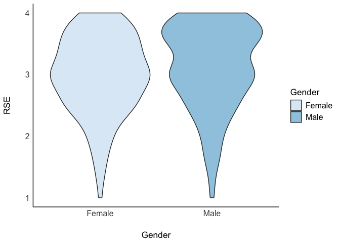

Lab3
================
Your Name
2024-09-19

# Load Packages

``` r
library(haven)
library(dplyr)
```

    ## 
    ## Attaching package: 'dplyr'

    ## The following objects are masked from 'package:stats':
    ## 
    ##     filter, lag

    ## The following objects are masked from 'package:base':
    ## 
    ##     intersect, setdiff, setequal, union

``` r
library(tidyr)
library(ggplot2)
library(psych)
```

    ## Warning: package 'psych' was built under R version 4.3.3

    ## 
    ## Attaching package: 'psych'

    ## The following objects are masked from 'package:ggplot2':
    ## 
    ##     %+%, alpha

``` r
library(bruceR)
```

    ## 
    ## bruceR (v2023.9)
    ## Broadly Useful Convenient and Efficient R functions
    ## 
    ## Packages also loaded:
    ## ✔ data.table ✔ emmeans
    ## ✔ dplyr      ✔ lmerTest
    ## ✔ tidyr      ✔ effectsize
    ## ✔ stringr    ✔ performance
    ## ✔ ggplot2    ✔ interactions
    ## 
    ## Main functions of `bruceR`:
    ## cc()             Describe()  TTEST()
    ## add()            Freq()      MANOVA()
    ## .mean()          Corr()      EMMEANS()
    ## set.wd()         Alpha()     PROCESS()
    ## import()         EFA()       model_summary()
    ## print_table()    CFA()       lavaan_summary()
    ## 
    ## For full functionality, please install all dependencies:
    ## install.packages("bruceR", dep=TRUE)
    ## 
    ## Online documentation:
    ## https://psychbruce.github.io/bruceR
    ## 
    ## To use this package in publications, please cite:
    ## Bao, H.-W.-S. (2023). bruceR: Broadly useful convenient and efficient R functions (Version 2023.9) [Computer software]. https://CRAN.R-project.org/package=bruceR

    ## 
    ## NEWS: A new version of bruceR (2024.6) is available (2024-06-13)!
    ## 
    ## ***** Please update *****
    ## install.packages("bruceR", dep=TRUE)

    ## 
    ## These packages are dependencies of `bruceR` but not installed:
    ## - pacman, lmtest, vars, phia, GPArotation
    ## 
    ## ***** Install all dependencies *****
    ## install.packages("bruceR", dep=TRUE)

``` r
library(ggsci)
```

    ## Warning: package 'ggsci' was built under R version 4.3.3

``` r
library(see)
```

    ## Warning: package 'see' was built under R version 4.3.3

    ## 
    ## Attaching package: 'see'

    ## The following objects are masked from 'package:ggsci':
    ## 
    ##     scale_color_material, scale_colour_material, scale_fill_material

# Load Datasets

``` r
lab3data <- read.csv("C:/Users/Colin/Documents/Github/Website/Lab3/lab3data.csv")
```

# Missing Data

``` r
#Listwise deletion
list_lab3data<- drop_na(lab3data)

#pair wise deletion will only be used when you run the actual analysis using "na.rm = TRUE"
```

# Recode Variables: Changing Numeric Values to Characters

``` r
lab3data %>% count(Gender)
```

    ##   Gender   n
    ## 1      1 154
    ## 2      2 145
    ## 3     NA   1

``` r
#Solution 1
lab3data<- lab3data%>%
  mutate_at(c('Gender'),funs(str_replace(., "1", "Male")))
```

    ## Warning: `funs()` was deprecated in dplyr 0.8.0.
    ## ℹ Please use a list of either functions or lambdas:
    ## 
    ## # Simple named list: list(mean = mean, median = median)
    ## 
    ## # Auto named with `tibble::lst()`: tibble::lst(mean, median)
    ## 
    ## # Using lambdas list(~ mean(., trim = .2), ~ median(., na.rm = TRUE))
    ## Call `lifecycle::last_lifecycle_warnings()` to see where this warning was
    ## generated.

``` r
#Solution 2

#lab3data$Gender<-recode(lab3data$Gender, '1' = 'X', '2' = 'Y')


#Now recode 2 into Female
```

# Recode Variables: Changing Numeric Values to Different Numeric Values

``` r
lab3data %>% count(RSE2)
```

    ##   RSE2   n
    ## 1    1 124
    ## 2    2  86
    ## 3    3  53
    ## 4    4  37

``` r
lab3data$RSE2_R <- 5 - lab3data$RSE2

#check to see if the recoding was successful
lab3data %>% count(RSE2_R)
```

    ##   RSE2_R   n
    ## 1      1  37
    ## 2      2  53
    ## 3      3  86
    ## 4      4 124

``` r
#Now do the same for the other items (5,6,8,9)
```

# Create Composites

``` r
#Depending on the scale, sometimes you need to average across the items, other times you might need to sum 


#Fill in the items
#lab3data <- lab3data %>%
  #mutate(RSE = rowMeans(cbind(RSE1, ..., RSE10)))

#Create another composite for SWL, but this time use rowSums
```

# Get Summary Descriptive Statistics

# Q1: Descrptively, which group has a higher self-esteem? What about life satisfaction? Is the relationship between self-esteem and life satisfaction stronger for males or for females?

# Visualization of Data Distribution

``` r
lab3data<- lab3data %>%
  drop_na(Gender)


ggplot(lab3data, aes(x = Gender, y = RSE1)) + geom_violin(aes(fill=Gender)) + scale_fill_simpsons() + theme_modern()
```

<!-- -->

``` r
#Create a plot for SWL by Gender with a different color palette
```

# Q2: What you can tell from looking at a violin plot? What you cannot tell? What inferences you can make based on the two violin plots?
